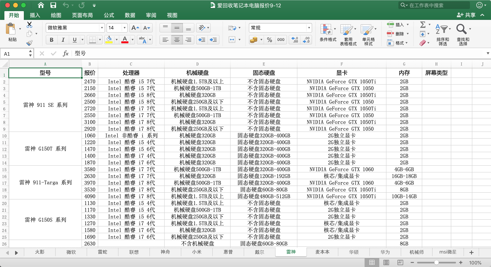
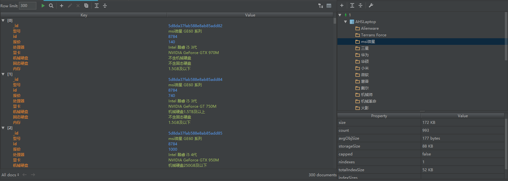
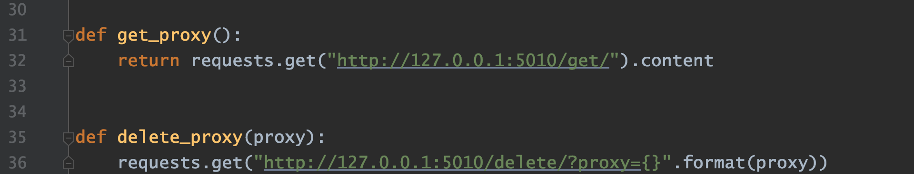
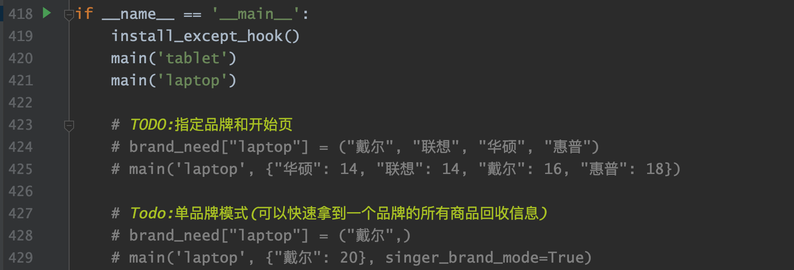

# AHS Spider

AHSSpider是一个[爱回收平台](https://www.aihuishou.com/)的爬虫项目，可爬取全平台的所有二手报价信息。

结果存在`mongodb`数据库中，支持导出`excel`

### 展示






### 开发环境及依赖

|  工具   | 版本号 |
| :-----: | :----: |
| python  | 3.6.8  |
| mongodb |  4.2   |
| fiddler |  5.0   |

### 如何使用

1. 配置一个代理池，该项目中使用的是`github`上的开源代理池[proxy_pool](https://github.com/jhao104/proxy_pool)，如果要使用其他代理池的话请更改项目中的`tools.py`

   

2. 爱回收平台对普通的代理是可以追到自身ip的，所以网上的免费透明代理爬一会就被封了，选择一家平台购买「高匿HTTPS代理」并在代理池中配置以实现不间断爬取

3. 配置mongodb

4. 项目中默认提供了「平板」和「笔记本电脑」的配置，可以直接在`AHSSpider/AHS/main_spider.py`下运行爬取任意品牌的二手报价并实时插入到数据库中

   

   

### 问题

#### 如何把数据库中的数据导出到excel`

`AHSSpider/Tools/export_to_excel.py`可以指定数据库和导出路径导出为excel数据。

#### 如何爬取其他商品信息，比如手机，摄影设备等

爱回收中获取报价的过程是先进入商品页，然后选择一系列商品的属性（配置，外观等），最后点击确定进行报价。所以需要获得某类商品中的关键属性来模拟属性的选择，关键属性的获取可以通过`AHSSpider/get_property.py`来获取

一共需要配置的信息包括：

```python
# 商品的根路径
goods_url = {
    "tablet": tablet_url,
    "laptop": laptop_url
}
# 商品品牌关键字(即想要爬取的品牌)
brand_need = {
  "tablet": tablet_brand_need, 
  "laptop": laptop_brand_need
}
# 关键属性(通过get_property获得)
essential_words = {
    "tablet": tablet_essential_words,
    "laptop": laptop_essential_words
}
# 商品-数据库名
AHS_database = {
    "tablet": "AHSTablet",
    "laptop": "AHSLaptop"
}
# 商品类型-商品页url中的参数（比如联想笔记本电脑第10页商品: /product/c5-b105-p10）
flag_dict = {
    "laptop": "c5",
    "tablet": "c6"
}
```

#### 如何知道当前的爬取进度

`log/debug.log`可以查看当前和之前的爬取情况

`log/output.log`可以查看爬取商品的总页数


### 具体分析过程

[https://yujunjiex.gitee.io/2019/09/30/爱回收二手平台爬虫分析](https://yujunjiex.gitee.io/2019/09/30/爱回收二手平台爬虫分析/)


### 参考项目

* [jhao104/proxy_pool](https://github.com/jhao104/proxy_pool) 代理池

